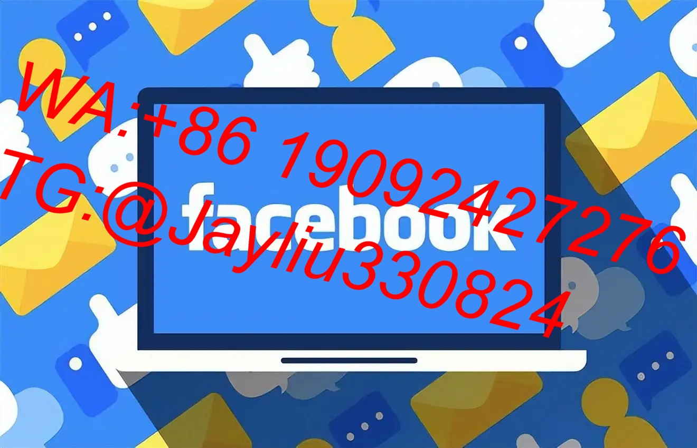
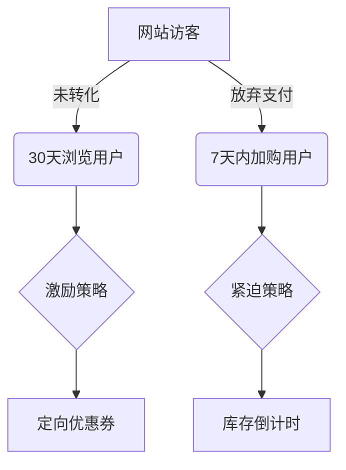

# Facebook广告优化策略与运营指南

---

## 营销受众配置策略
### 受众筛选分层逻辑
**初始测试阶段**
- 5组相似兴趣定位（核心词+精准词组合）
- 每定位组预算$5-8
- 连续监控72小时

**动态优化阶段**
- 筛选3组CTR≥2%的定位组
- 扩充1-3阶相似受众
- 清洗重复曝光＞7次的用户

---

## 广告素材创建规则
### 新素材验证流程
```process-step
1. 创意储备 → 建立素材池（视频/图片≥5版）
2. 变量测试 → 绑定多组兴趣词
3. 数据观察 → 48小时流量波动监控
4. 效果固化 → 3组优质素材交叉复用
```

### 图文广告制作标准
| 要素          | 技术规格                  | 质量门槛           |
|---------------|--------------------------|--------------------|
| 主视觉尺寸    | 1080×1080 px             | 分辨率≥300dpi      |
| 标题长度      | ≤15字符（中文）          | 核心词前置         |
| 行动号召按钮  | 亮色系/反差配色          | 按钮面积≥3%画幅    |
| 文案信息密度  | 卖点≤3条/辅助信息≤5行    | 字号≥16pt         |

---

## 预算调控管理方案
### 动态调节规则
| 监测指标      | 触发动作                | 调整幅度范围       |
|---------------|-------------------------|--------------------|
| CPM≥$25       | 暂停+复制新组          | 降低定位精度15%   |
| CTR≤0.8%      | 替换首屏素材           | 预算重分配20%-40% |
| 转化成本＞均值| 扩展展示版位           | 增加备用受众30%   |

### 学习期保护机制
- 72小时内保持投放策略稳定
- 每次调整幅度≤总预算25%
- 禁止连续2天修改定位参数

---

## 再营销技术实施
### 用户挽回模型


### 执行标准配置
| 用户行为        | 触发条件           | 投放频次       |
|----------------|-------------------|---------------|
| 页面浏览≥5次   | 三天未回访         | 每日1次        |
| 购物车放弃      | 12小时未完成       | 每6小时1次     |
| 视频观看≥50%   | 未产生互动         | 隔日重复       |

---

## 运营效能监控规范
### 核心性能指标
| 维度          | 健康标准            | 异常处置           |
|--------------|---------------------|--------------------|
| 账户稳定性    | 存活周期≥6个月     | 灰度测试替补账户   |
| 素材新鲜度    | 周更新率≥20%       | 自动启动备选库     |
| 转化成本偏差  | ≤基准值15%         | 实时切换落地页     |
| 域名安全性    | 日均访问量波动≤20% | 72小时流量迁移     |

> **日常操作建议**：每日9点/15点/21点分别进行三次数据校准，每周四执行全链路健康诊断。重要策略变更需预留48小时测试窗口，建议同时运行2-3组对比实验。
[教学视频](https://youtube.com/shorts/wKcNl56_264?feature=share)
